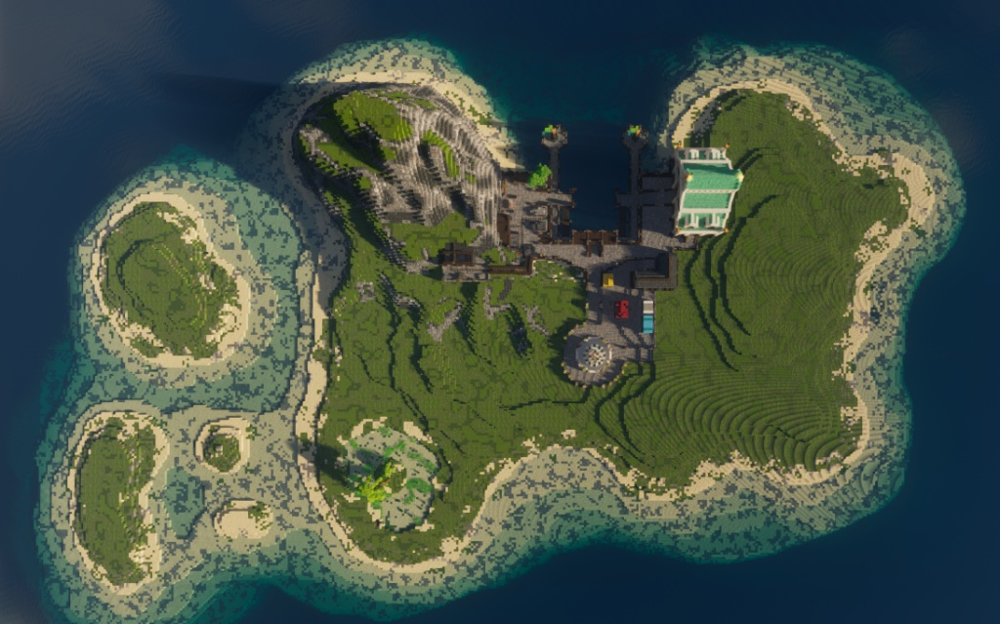
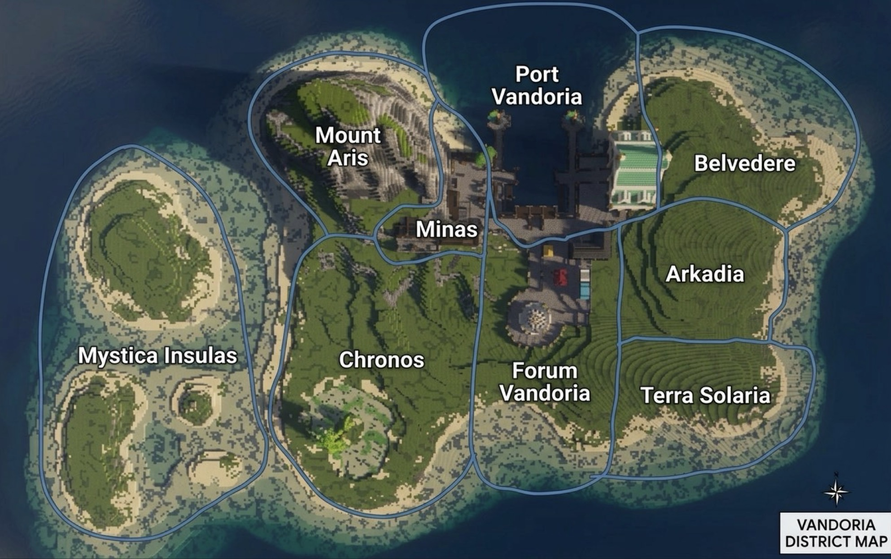

# Vandoria

## Map

### General Map

### Districts

---

## Lore & Stadtgeschichte

### 1. Geschichte & Wandel
* **Kurzform:** Unbewohnte Klippeninsel -> Erzfund im Berg -> Rascher Aufstieg vom Feldlager zum prunkvollen Frührenaissance-Stadtstaat.
* **Langform:** Vandoria war ursprünglich eine unbewohnte, dicht bewaldete Insel mit steilen Felsküsten. Der Fund ertragreicher Erz- und Mineralienadern im zentralen Bergmassiv führte zu einer schlagartigen Besiedlung. Unter der Führung einflussreicher Handelsgilden entwickelte sich das anfängliche Bergbaulager zu einem wohlhabenden, strategisch bedeutenden Stadtstaat.

### 2. Architektur & Stadtbild
* **Kurzform:** Frührenaissance, robuster Stein, rote Ziegel, smaragdgrüne Kupferdächer, venezianische Kaimauern und Bogenstrukturen.
* **Langform:** Das Stadtbild vereint wehrhaften Steinbau mit prunkvollen Renaissance-Elementen. Auffallend sind die tiefroten Ziegelakzente und die smaragdgrünen Dächer, die herannahenden Schiffen als Landmarke dienen. Entlang der Wasserkante prägen venezianisch anmutende Bögen und Säulen die Uferfront.

---

## Die Bezirke & Orte

### 1. Port Vandoria
Das maritime Herzstück der Insel.
* **Kurzform:** Belebter Seehafen mit massiven Kaimauern, Güterumschlag und geschäftigem Treiben.
* **Atmosphäre:** Geruch von Salz, Holz und Fisch; Wachen, Seefahrer und Kistenstapler prägen das Straßenbild.
* **Wichtige Orte:**
  * **Der Kartograph:**
    * **Kurzform:** Nische am Dock für Seekarten und lokale Informationen.
    * **Langform:** Eine kleine, direkt in die Kaimauer eingelassene Werkstatt am Hauptdock, in der Seekarten und navigatorisches Wissen verkauft werden.
  * **Der Hafenpalast (Das Großlager):**
    * **Kurzform:** Bewachtes Zunfthaus im venezianischen Stil zur Lagerung wertvoller Exporte.
    * **Langform:** Imposantes Bauwerk direkt am Wasser mit Holzarkaden und smaragdgrünem Dach. Es dient als Hauptlager für die edelsten Erze und Importgüter.
  * *[Eigenes Gebäude hier eintragen]*

### 2. Mount Aris
Das mächtige Bergmassiv im Nordwesten.
* **Kurzform:** Schroffes Felsmassiv, das als städtische Skyline ragt und die Erzadern birgt.
* **Atmosphäre:** Windig, steil, karg und von natürlicher Härte geprägt.
* **Wichtige Orte:**
  * **Der Berggipfel / Aussichtspunkt:**
    * **Kurzform:** Höchster Punkt der Insel mit Rundumblick über die Stadt und das Meer.
    * **Langform:** *[Lore / Beschreibung eintragen]*
  * *[Eigenes Gebäude hier eintragen]*

### 3. Minas
Das Bergbau- und Industrieareal am Hang von Mount Aris.
* **Kurzform:** Verrußtes Industriegebiet für Erzabbau und Transport.
* **Atmosphäre:** Staubige Luft, Lärm von Spitzhacken und Förderanlagen, ständiger Betrieb.
* **Wichtige Orte:**
  * **Die Erzmine & Das Transportsystem:**
    * **Kurzform:** Haupteingang zur Mine mit Schienenstrang und Holzrutschen direkt zum Hafen.
    * **Langform:** Tiefes Stollennetzwerk am Berghang. Ein ausgeklügeltes Schienensystem befördert die geförderten Erze ohne Umwege hinab zum Hafenviertel.
  * *[Eigenes Gebäude hier eintragen]*

### 4. Forum Vandoria
Das administrative und gesellschaftliche Zentrum.
* **Kurzform:** Prachtvolles Regierungs- und Versammlungsviertel oberhalb der Prachttreppe.
* **Atmosphäre:** Erhaben, sauber, gut bewacht und repräsentativ.
* **Wichtige Orte:**
  * **Das Rathaus von Vandoria:**
    * **Kurzform:** Monumentales Gebäude mit venezianischen Bögen und zwei Glockentürmen; Sitz des Stadtrats.
    * **Langform:** Das architektonische Hauptwerk der Insel am Ende der zentralen Sichtachse. Ausgestattet mit zwei hohen Türmen mit grünen Kuppeln, roten Ziegelwänden und Säulen.
  * **Der Prachtbrunnen:**
    * **Kurzform:** Altarbrunnen mit Rosensträuchern als zentraler städtischer Treffpunkt.
    * **Langform:** Runder, mehrstufiger Steinbrunnen auf dem Vorplatz des Rathauses, der als optischer Knotenpunkt aller Hauptwege dient.
  * *[Eigenes Gebäude hier eintragen]*

### 5. Arkadia
Das belebte Handels- und Marktviertel.
* **Kurzform:** Dicht gebautes Viertel für Handel, Handwerk und Gilden.
* **Atmosphäre:** Lautes Marktschreien, bunte Farben, Menschenmengen und kaufmännische Hektik.
* **Wichtige Orte:**
  * **Der Marktplatz:**
    * **Kurzform:** Zentraler Platz mit bunten Ständen für Stoffe, Werkzeuge und Spezialwaren.
    * **Langform:** Pflastersteinplatz direkt am Brunnenareal, auf dem fliegende Händler unter farbigen Stoffdächern ihre Waren feilbieten.
  * **Das L-förmige Gildenhaus:**
    * **Kurzform:** Sitz der Handels- und Handwerksgilden, das den Markt einrahmt.
    * **Langform:** Winkelartiges Baugewerke mit dunklem Gebälk und Ziegeln, das den Marktplatz nach Nord-Westen hin abschließt.
  * *[Eigenes Gebäude hier eintragen]*

### 6. Belvedere
Das gehobene Klippen-Wohnviertel im Nordosten.
* **Kurzform:** Ruhiges Wohnareal auf den Klippen mit Panoramablick.
* **Atmosphäre:** Frische Meeresbrise, weitläufig, ruhig und exklusiv.
* **Wichtige Orte:**
  * *[Eigenes Gebäude hier eintragen]*

### 7. Terra Solaria
Das südliche Wohnviertel im Grünen.
* **Kurzform:** Lockere Wohnbebauung mitten in den südlichen Grünflächen.
* **Atmosphäre:** Entspannt, ländlich angehaucht und naturnah.
* **Wichtige Orte:**
  * *[Eigenes Gebäude hier eintragen]*

### 8. Chronos
Das historische Viertel im architektonischen Wandel.
* **Kurzform:** Ältestes Viertel, in dem Mittelalterbauten schrittweise zu Renaissance-Bauten umgebaut werden.
* **Atmosphäre:** Rustikal, leicht verwinkelt, Baustellen-Flair an einzelnen Gebäuden.
* **Wichtige Orte:**
  * *[Eigenes Gebäude hier eintragen]*

### 9. Mystica Insulas
Die unberührte Insel- und Naturzone im Westen.
* **Kurzform:** Mytischer boden für Zauberpflanzen
* **Atmosphäre:** Mystisch, still, naturbelassen und isoliert.
* **Wichtige Orte:**
  * **Der Schrein-See:**
    * **Kurzform:** Kristallklarer Waldsee mit Palm-Insel in der Mitte.
    * **Langform:** Abgelegener See südwestlich des Bergmassivs. In der Mitte befindet sich eine kleine Insel mit einer markanten Palme; der Ort wird aus Respekt vor alten Kräften gemieden.
  * *[Eigenes Gebäude / Schrein hier eintragen]*
